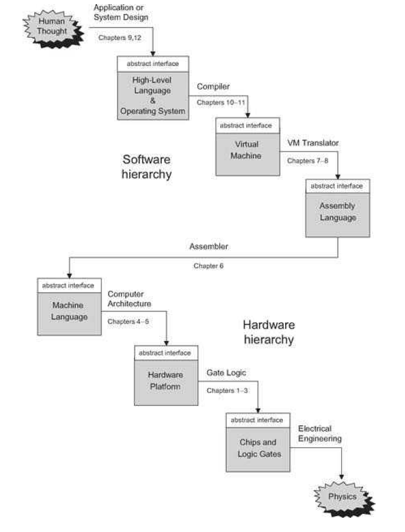

# The Elements of Computing Systems
---
## This repo covers my journey through the book
---

---
Click to access the book:
[The book](assets/The%20Elements%20of%20Computing%20Systems.pdf)
---
1. Boolean logic - Status : In progress
2. Boolean arithmetic - Status : Not started
3. Sequential logic - Status : Not started
4. Machine language - Status : Not started
5. Computer architecture - Status : Not started
6. Assembler - Status : Not started
7. Virtual machine 1 - Status : Not started
8. Virtual machine 2 - Status : Not started
9. High level language - Status : Not started
10. Compiler 1 - Status : Not started
11. Compiler 2 - Status : Not started
12. Operating system - Status : Not started